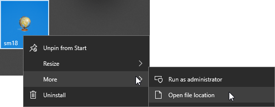

## SMA 101

### First-time setup

Run `SuperMemoAssistant.exe`. If you can't find SMA, learn how to [create a shortcut](qs-installation#optional-create-a-shortcut).

?> ❔ On the first execution, SMA will ask you for your SuperMemo executable path.

!> If SMA cannot find your SuperMemo executable, and you do not know how to find it, [follow this procedure](#i-can39t-find-my-supermemo-executable-path).

### Selecting your collection

The first window in SMA is the **Collection Browser**. It allows you to add, and select **which collection to use**.

- **To add a new collection**: Press the <kbd>Browse</kbd> button, and select your `.kno` collection file.
- **To open your collection**: Make sure it is *selected from the list*, then click <kbd>Open</kbd>, or press <kbd>enter</kbd>.

?> Once SuperMemo is running, you can use it just as you normally would. **Additional keyboard shortcuts** and **interactions** are adjoined by SMA.

You can always know whether SMA is running by checking the robot icon in your **tray bar** (image 👉)

## SMA 102

<!-- PDF -->

[plugin-pdf-common.md](plugin-pdf-common.md ':include')

<!-- Import -->

[plugin-Import-common.md](plugin-Import-common.md ':include')

## SMA 103

### Plugins

- [Incremental PDF](plugin-pdf.md) unlocks the power of SuperMemo for PDF files.
- [LaTeX](plugin-LaTeX.md) integrates LaTeX in your SuperMemo elements.
- [Import](plugin-Import.md) lets you finally get rid of old Internet Explorer.
- [Dictionary](plugin-Dictionary.md) will expand your vocabulary with the help of Oxford dictionary.

### Changing keyboard shortcuts

### Settings

## Glossary

[plugin-pdf-glossary.md](plugin-pdf-glossary.md ':include')

## FAQ

### I can't find my SuperMemo executable path

1. Find your shortcut to `sm1x.exe` (the one you use to run SuperMemo)
2. <kbd>Right click</kbd> on the shortcut, then click on **More**, and finally click on **Open file location**

3. In the new Windows Explorer window, <kbd>right click</kbd> on the `sm1x` shortcut, and click on **Properties**.

4. In the file property dialog, find the **Target** text box. This is the location of your SuperMemo executable.

